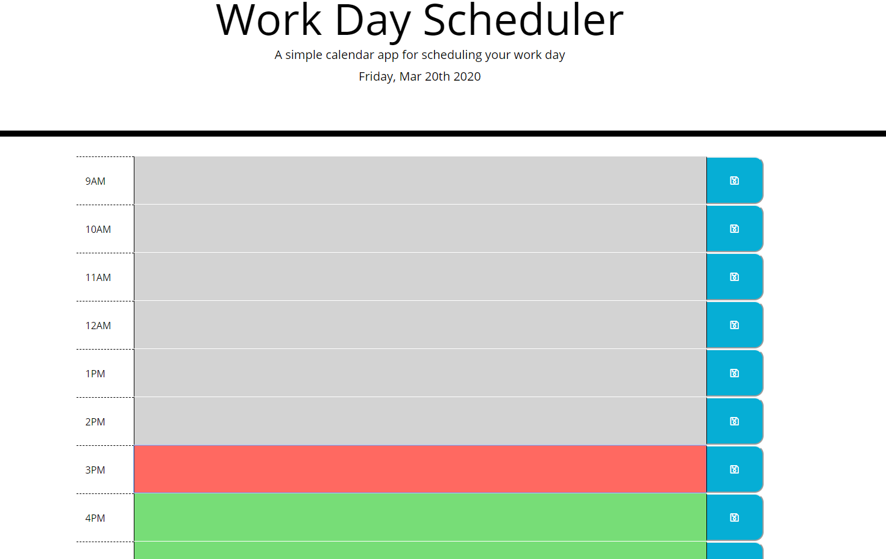

This day planner app  allows the user to save events for each hour of the day. This app will run in the browser and feature dynamically updated HTML and CSS powered by jQuery. It uses the Moment.js library to work with date and time

https://github.com/DDavidson202020/day_planner

